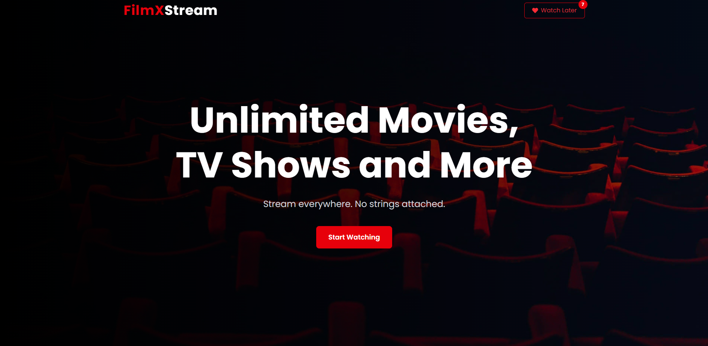
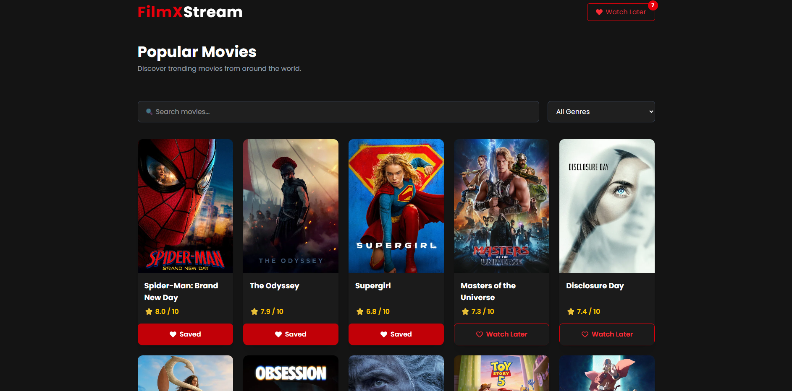
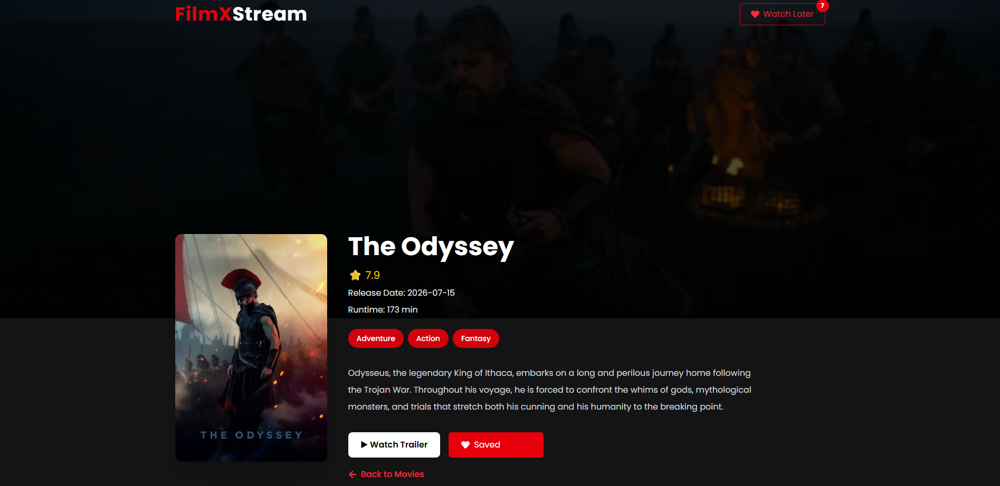
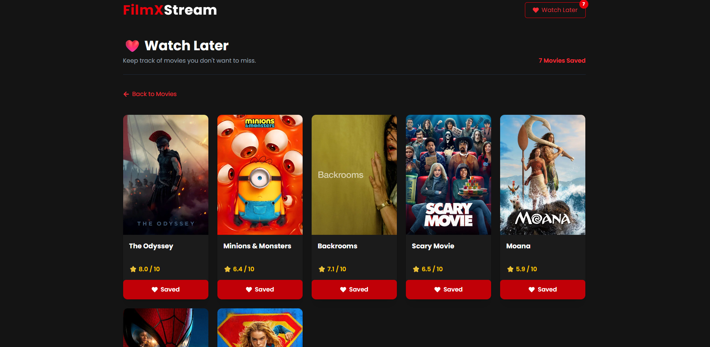

# 🎬 FilmXStream

A modern movie discovery web application built with **React**, **Redux Toolkit**, **Tailwind CSS**, and the **TMDB API**.

Browse trending movies, search by title, filter by genre, watch official trailers, and save your favourite movies to a persistent **Watch Later** list.

---

## 📖 About the Project

FilmXStream is a portfolio project created to strengthen my frontend development skills using React and modern web technologies.

The application focuses on clean UI/UX, reusable components, responsive design, Redux Toolkit for state management, and API integration with The Movie Database (TMDB).

It was built with the goal of following real-world development practices, including component reusability, loading states, error handling, responsive layouts, and smooth user interactions.

---

## ✨ Features

- 🎬 Browse trending movies from TMDB
- 🔍 Search movies by title
- 🎭 Filter movies by genre
- ❤️ Add and remove movies from the Watch Later list
- 💾 Persistent Watch Later state using Redux Toolkit
- ▶️ Watch official movie trailers
- 📱 Fully responsive design for desktop, tablet, and mobile
- ⚡ Smooth page transitions with Framer Motion
- ⬆️ Scroll-to-top button
- 💀 Custom Empty States
- 🚫 Professional 404 page
- 🎨 Netflix-inspired modern UI

---

## 🛠 Tech Stack

### Frontend

- React
- React Router DOM
- Redux Toolkit
- Tailwind CSS
- Framer Motion

### API

- TMDB API

### Libraries

- Axios
- React Icons

---

## 📸 Screenshots

### 🏠 Landing Page



### 🎬 Movies Page



### 🎥 Movie Details



### ❤️ Watch Later



---

## 🚀 Installation

Clone the repository:

```bash
git clone https://github.com/YOUR_USERNAME/FilmXStream.git
```

Navigate into the project:

```bash
cd FilmXStream
```

Install dependencies:

```bash
npm install
```

Create a `.env` file in the project root and add your TMDB API key:

```env
VITE_TMDB_API_KEY=YOUR_API_KEY
```

Start the development server:

```bash
npm run dev
```

---

## 🔑 Environment Variables

| Variable | Description |
|----------|-------------|
| `VITE_TMDB_API_KEY` | Your TMDB API key |

---

---

## 📚 What I Learned

Building FilmXStream helped me strengthen my understanding of:

- React component architecture
- State management with Redux Toolkit
- React Router for navigation
- API integration using Axios
- Building reusable UI components
- Responsive design with Tailwind CSS
- Managing loading, error, and empty states
- Creating smooth page transitions with Framer Motion
- Organizing scalable React project structures

---

## 🔮 Future Improvements

- 🔐 User Authentication
- 🌙 Dark/Light Theme
- ⭐ Movie Ratings & Reviews
- 📄 Pagination / Infinite Scrolling
- 🤖 Movie Recommendations
- 🎭 Cast & Actor Details
- 📺 TV Shows Support

---

## 🙏 Acknowledgements

Movie data and images are provided by **The Movie Database (TMDB)**.

A huge thanks to TMDB for providing a free and developer-friendly API that made this project possible.

---

## 👨‍💻 Author

**Wasif Ansari**

GitHub: [@wasifansari22](https://github.com/wasifansari22)